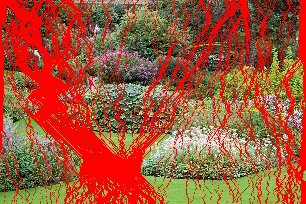

# Seam Carving with Parallelization

A high-performance, content-aware image resizing using seam carving. This project implements serial and parallelized versions of the seam carving algorithm, with a command-line interface (CLI) for ease of use.

## Overview

Seam carving is a content-aware image resizing technique that removes or inserts seams (paths of least importance) in an image, preserving the visually significant content. This project provides an optimized implementation that leverages multi-threading via Python’s `concurrent.futures` module to dramatically speed up processing times.

## Example Images
<p align="center">
  
  
  
</p>

## Performance
The project showcases the benefits of parallel processing:
- **Serial Implementation:** ~115 seconds for the provided sample image.
- **Parallel Implementation:** ~9.2838 seconds for the same image.

The parallel implementation is roughly **12 times faster** than the serial version.
## Project Structure

```
.
├── in
│   └── images
│       └── image.jpg                # Sample input image
├── out
│   └── images                       # Output images are saved here                  
├── main.py                          # Main entry point (if needed)
├── seam_carve_cli.py                # CLI tool for seam carving
├── serial_seam_carving.py           # Serial version of seam carving for benchmarking
└── Parallelized_seam_carving.py     # Core seam carving implementation with parallel support
├── README.md  
```

## Installation

1. **Clone the Repository:**

   ```bash
   git clone https://github.com/AhmedYasserrr/Seam-Carving-with-Parallelization.git
   cd Seam-Carving-with-Parallelization
   ```

2. **Install Dependencies:**

   This project requires Python 3.x, OpenCV, and NumPy. Install them via pip:

   ```bash
   pip install numpy opencv-python
   ```

## How to Use the CLI

The CLI tool is provided via `seam_carve_cli.py`. You can run it directly from the command line.

### Default Usage

If you run the CLI tool without any options, it defaults to:
- **Input Image:** `in/images/image.jpg`
- **Output Image:** `out/images/image_result.png`

```bash
python seam_carve_cli.py -H 278 -W 600
```

### Custom Usage

You can override the defaults by specifying the input, output, height, and width:

```bash
python seam_carve_cli.py -i path/to/input.jpg -o path/to/output.png -H 278 -W 600
```

- `-i` or `--input`: Path to the input image.
- `-o` or `--output`: Path where the output image will be saved.
- `-H` or `--height`: Desired output height (defaults to original if not provided).
- `-W` or `--width`: Desired output width (defaults to original if not provided).
